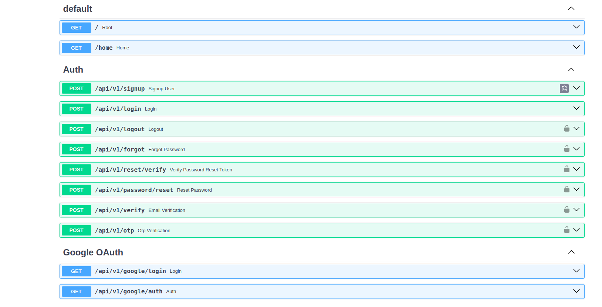

## Folder structure of fastapi mongo

This is a simple package that helps you to create a FastAPI project with MongoDB it comes with default crud operations and database setup just configure your environment variables and you are good to go.

## Preview of the swagger UI docs



## Included working authentication as well
It includes authentication setup as well just change the environment varibles and you are good to go 

## Installation process
```
pip install fastapi-mongo
```
## Bulding the project
build the project using the following command
```
build
```

## Provided folder structure is as follows
```
.
├── app
│   ├── apis
│   │   ├── auth.py
│   │   ├── google.py
│   │   └── __init__.py
│   ├── config
│   │   ├── cloudinary_config.py
│   │   ├── dependencies.py
│   │   ├── __init__.py
│   │   └── oauth_config.py
│   ├── core
│   │   ├── database.py
│   │   └── __init__.py
│   ├── handlers
│   │   ├── Auth
│   │   │   ├── authhandler.py
│   │   │   ├── emailHandler.py
│   │   │   └── __init__.py
│   │   ├── exception.py
│   │   └── __init__.py
│   ├── __init__.py
│   ├── models
│   │   ├── __init__.py
│   │   └── schemas.py
│   └── utils
│       ├── authutils.py
│       ├── envutils.py
│       ├── __init__.py
│       ├── jwtutil.py
│       └── passhashutils.py
├── Dockerfile
├── main.py
└── requirements.txt
```
## Navigation 

- `routers/auth.py`: This file contains the routes related to authentication.
- `routers/user.py`: This file contains the routes related to user management.
- `utils/envutils.py`: This file contains utility functions for managing environment variables.
- `utils/jwtutil.py`: This file contains utility functions for handling JSON Web Tokens.
- `utils/passhashutils.py`: This file contains utility functions for hashing passwords.
- `handlers/authhandlers.py`: This file contains the AuthHandler class and the functions for authenticaton
-  `handlers/userhandler.py`: This file contains the UserHandler class and the functions for user management
-  `models/models.py`: This file contains the models for the database
-  `models/schemas.py`: This file contains the schemas for the models
-  `config/dependencies.py`: This file contains the dependencies for the FastAPI app
-  `core/database.py`: This file contains the database connection setup
-  `main.py`: This file contains the FastAPI app setup
-  `requirements.txt`: This file contains the required packages for the project

## Usage
- Create a `.env` file in the root directory of the project or rename the `.env.sample` to `.env` and add the following environment variables:
```
MONGO_URI=<your_mongo_uri>
SECRET_KEY
ALGORITHM
ACCESS_TOKEN_EXPIRE_MINUTES
```
- Change the db name in the `core/database.py` file as per your requirement.
```
db=client["fastapi-mongo"]
users_collection = db["users"]
```
- If you want to run the default then create a database with the name `fastapi-mongo` in your MongoDB instance.


- Run the following command to start the FastAPI app:
```
uvicorn main:app --reload
```


- The FastAPI app will start running on `http://localhost:8000`.
- Navigate to `http://localhost:8000/docs` to view the Swagger UI and test the API endpoints.
- You can also navigate to `http://localhost:8000/redoc` to view the ReDoc documentation.


